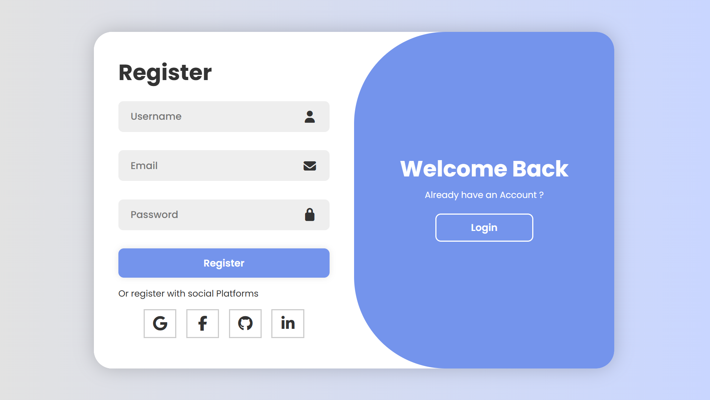

# Sliding Sign Up / Login Page ✨

A modern and responsive **Sign Up & Login page** built using **HTML, CSS, and JavaScript**.  
This project features a beautiful **sliding animation** between login and registration forms.

---

## 🚀 Features
- Smooth sliding transition between Login and Register sections  
- Fully responsive design  
- Modern UI with gradient background  
- Interactive animations using CSS transitions and pseudo-elements  
- Simple and clean code structure for beginners

---

## 🖥️ Technologies Used
- **HTML5**
- **CSS3** (Flexbox, Transitions, Pseudo-elements)
- **JavaScript** (DOM manipulation)

---

## 📸 Preview
Here’s a preview of the UI (replace `preview.png` with your screenshot file located in the repo root):



---

## ⚙️ How to Use
1. Clone this repository  
   ```bash
   git clone https://github.com/Mahvish162/SlidingSignUpLogin.git

2. Open the project folder:
   ```bash
   cd SlidingSignUpLogin
3. Open the index.html file in your browser:
   - Double-click index.html, or
   - Run a local server (recommended) and navigate to http://localhost:5500 (if using Live Server / VS Code extension).

# 🧠 Learning Purpose

This project helped me understand:

- How to toggle between two UI sections using JavaScript (adding/removing a class)
- How CSS z-index, transition, and pseudo-elements (::before) can be used to build animations
- Structuring small front-end projects and pushing them to GitHub

  # 🌸 Author

  **Mahvish Fatima**
-💌 If you like this project, consider starring ⭐ the repo!
